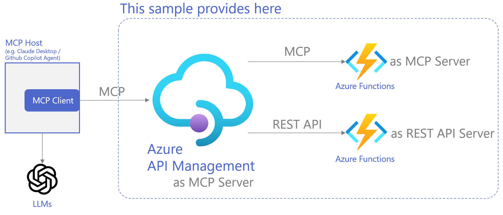

# mcp-apim-functions-sample
Azure reference implementation of MCP server with API Management and Functions

### Architecture



### What this repo provides

This is a minimal Azure sample that exposes, through a single Azure API Management (APIM) gateway:

- An MCP server hosted on Azure Functions (Python programming model v2) exposing **Tools** (read-only, restaurant menu scenario)
- A small REST API hosted on Azure Functions for **state-changing** operations (create/read orders), additionally exposed by APIM as **MCP tools**

It is designed for learning and validation, and can be deployed end-to-end with Azure Developer CLI:

- One command deployment: `azd up`
- APIM is the only intended public entrypoint
- Azure Functions on **Flex Consumption**
- Application Insights enabled

Endpoints (APIM public):

- MCP server (menu/constraints, Streamable HTTP): APIM **Existing MCP server** endpoint URL (shown in `azd up` output)
- MCP server (orders, Streamable HTTP): APIM **Expose REST API as MCP server** endpoint URL (shown in `azd up` output)

Authentication (sample): APIM subscription key.

Note: Depending on your APIM configuration, the subscription key may be optional. The included smoke test script supports both modes.

### How to use

Prerequisites:

- An Azure subscription
- Azure Developer CLI (`azd`)
- Azure CLI (`az`)

Deploy:

```bash
azd auth login
azd env set APIM_PUBLISHER_EMAIL "you@example.com"
azd env set APIM_PUBLISHER_NAME "Your Name"
azd up
```

Note: Resource naming uses `AZURE_ENV_NAME` via `infra/main.parameters.json` so the Azure environment name you enter for `azd` is reflected in provisioned resource names.

After `azd up`, note the printed APIM gateway base URL and subscription key.

Call the REST API (example):

```bash
curl -sS -X POST "${APIM_BASE_URL}/api/orders" \
	-H "Content-Type: application/json" \
	-H "Ocp-Apim-Subscription-Key: ${APIM_SUBSCRIPTION_KEY}" \
	-d '{"menuVersion":"v1","items":[{"menuItemId":"ramen-shoyu","quantity":1}],"note":"No onions"}'
```

Call the MCP server:

- Use any MCP client that supports **Streamable HTTP**.
- For VS Code / GitHub Copilot, configure the server URL(s) printed by `azd up` and include the `Ocp-Apim-Subscription-Key` header.

Note: APIM MCP endpoints may respond with SSE-framed output (`event:` / `data:`) even when the backend uses Streamable HTTP.

Smoke test:

- Run `./tests/apim_smoke_test.sh` to validate REST + MCP through APIM.

Clean up:

```bash
azd down
```

---

## 日本語

### このリポジトリが提供するもの

このリポジトリは、単一の Azure API Management（APIM）をゲートウェイとして、次を同時に公開する最小サンプルです。

- Azure Functions（Python プログラミングモデル v2）で動作する **MCP サーバー**（参照系の **Tools** を公開。レストランメニュー想定）
- Azure Functions で動作する **REST API**（注文の作成/参照など、状態変更系）

学習・検証用途のため、機能は最小限です。Azure Developer CLI により一括デプロイできます。

- `azd up` でインフラ + アプリをまとめてデプロイ
- 公開エンドポイントは APIM を想定
- Azure Functions は **Flex Consumption**
- Application Insights を有効化

エンドポイント（APIM 外向け公開）:

- MCP server（参照系: メニュー/制約。Streamable HTTP）: APIM の **Existing MCP server** の Server URL（`azd up` 出力に表示）
- MCP server（注文系: orders 操作を tools として公開。Streamable HTTP）: APIM の **REST API as MCP server** の Server URL（`azd up` 出力に表示）

認証（サンプル）: APIM Subscription Key。

注: APIM の設定によっては Subscription Key を不要にできます。本リポジトリのスモークテストはどちらの設定でも動作するようにしています。

### このリポジトリの利用方法

#### 前提:

- Azure サブスクリプション
- Azure Developer CLI（`azd`）
- Azure CLI（`az`）

#### デプロイ:

```bash
azd auth login
azd env set APIM_PUBLISHER_EMAIL "you@example.com"
azd env set APIM_PUBLISHER_NAME "Your Name"
azd up
```

`azd up` の出力に表示される APIM のベース URL と Subscription Key を控えてください。

#### Fuctionsテスト
以下のコマンドで関数アプリが正常に動作しているか確認することができます。
```bash
./tests/functions_smoke_test.sh
```

手動でREST APIを呼び出したい場合は以下を参考にしてください:

```bash
curl -sS -X POST "${APIM_BASE_URL}/api/orders" \
	-H "Content-Type: application/json" \
	-H "Ocp-Apim-Subscription-Key: ${APIM_SUBSCRIPTION_KEY}" \
	-d '{"menuVersion":"v1","items":[{"menuItemId":"ramen-shoyu","quantity":1}],"note":"No onions"}'
```

#### API Management上の設定

※ 本来MCP設定もBicepで可能かと思われますが、十分なドキュメント情報がないためAPIMのMCP設定は
ひとまずポータルで行ってください。

API Management経由でMCPを設定できるようにしたい場合には以下を設定してください。

1. Orders APIの登録（準備）
 - APIs > API > Create from definition > OpenAPIからdocs/api.yamlを登録する。
 - 登録後、Settingsから``https://<Order 関数アプリURL>/apiをWeb service URLに設定
 - API URL suffixを空にする（apiを指定すると重複）

2. Orders MCPの登録
 - MCPサーバー > MCPサーバーの作成から「API を MCP サーバーとして公開する」を選択する
 - APIとしてRestaurants Order APIを選択、API操作はすべてのAPIを選択する
 - 新しいMCPサーバーの設定として以下を指定して「作成」
   - Display Name: Retaurant-Order-MCP
   - Name: restaurant-order-mcp
   - 説明: Menuの料理をオーダーできます

3. Menu MCPの登録
 - MCPサーバー > MCPサーバーの作成から「既存の MCP サーバーを公開する」を選択する
 - 新しいMCPサーバーの設定として以下を指定して「作成」
   - MCP サーバーのベース URL: https://<Menu MCP関数アプリのURL>/menu-mcp を指定
   - Display name: Menu List MCP
   - Name: menu-list-mcp
   - 説明: このレストランのメニューの一覧を参照できます

以上でバックエンドの関数アプリをAPI ManagementでMCPとして公開できます。

登録されたMCPの設定やポリシーを変更することでサブスクリプションキー認証を掛けたり、様々なポリシーを適用できます。また、APIと同様に製品等を経由して公開することも可能です。


```bash
./tests/apim_smoke_test.sh
```
を実行すると、APIM 経由で MCP toolsの疎通確認ができます。

#### 削除:

```bash
azd down
```
