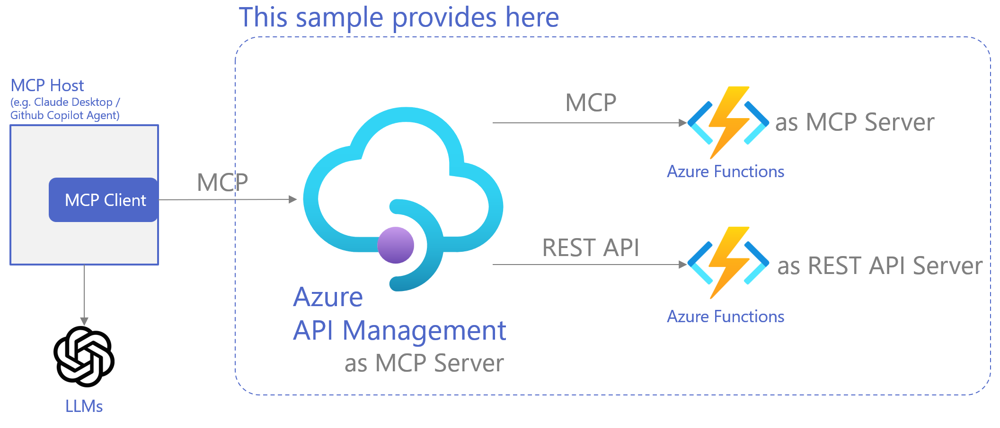
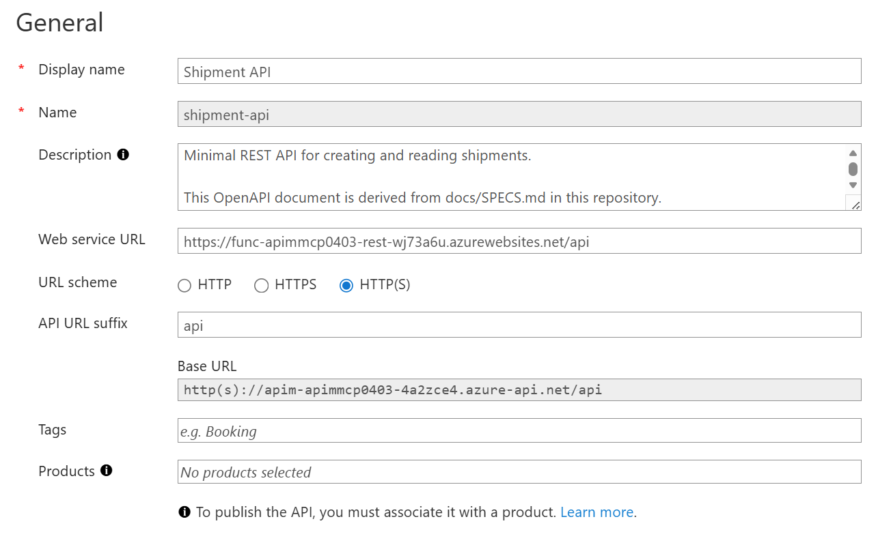
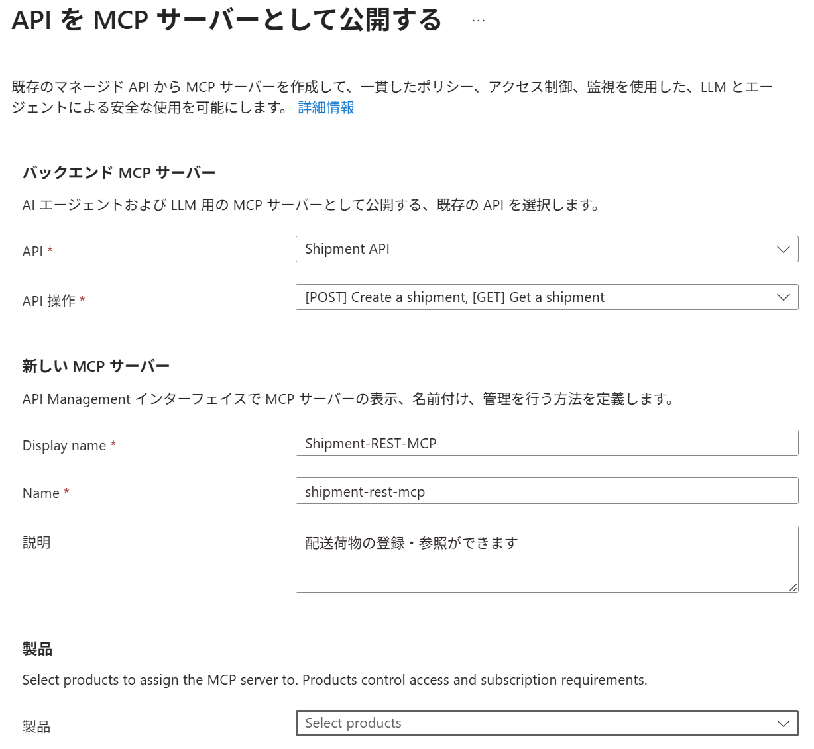
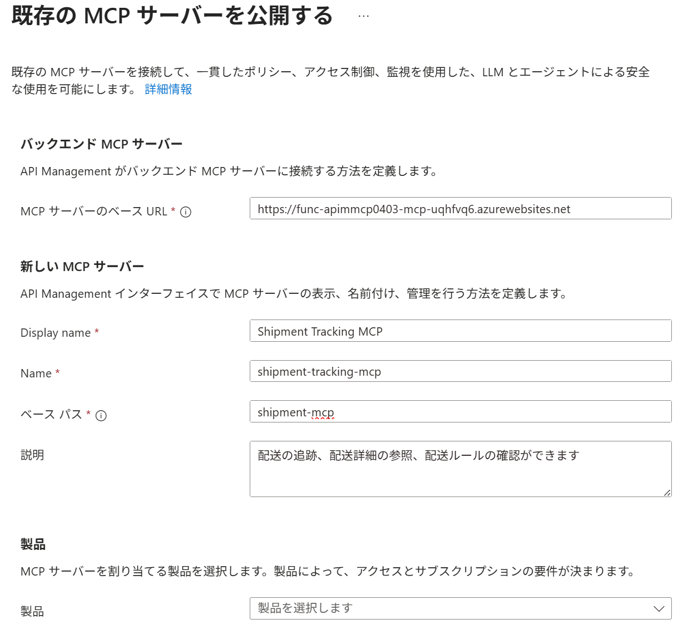

# mcp-apim-functions-sample
Azure reference implementation of MCP server with API Management and Functions

### Architecture



### What this repo provides

This is a minimal Azure sample that exposes, through a single Azure API Management (APIM) gateway:

- An MCP server hosted on Azure Functions (Python programming model v2) exposing **Tools** (read-only, shipment tracking scenario)
- A small REST API hosted on Azure Functions for **state-changing** operations (create/read shipments), additionally exposed by APIM as **MCP tools**

It is designed for learning and validation, and can be deployed end-to-end with Azure Developer CLI:

- One command deployment: `azd up`
- APIM is the only intended public entrypoint
- Azure Functions on **Flex Consumption**
- Application Insights enabled

Endpoints (APIM public):

- MCP server (shipment tracking/details/rules, Streamable HTTP): APIM **Existing MCP server** endpoint URL (shown in `azd up` output)
- MCP server (shipments, Streamable HTTP): APIM **Expose REST API as MCP server** endpoint URL (shown in `azd up` output)

Authentication (sample): APIM subscription key.

Note: Depending on your APIM configuration, the subscription key may be optional. The included smoke test script supports both modes.

### How to use

Prerequisites:

- An Azure subscription
- Azure Developer CLI (`azd`)
- Azure CLI (`az`)

Deploy:

```bash
azd auth login
azd env set APIM_PUBLISHER_EMAIL "you@example.com"
azd env set APIM_PUBLISHER_NAME "Your Name"
azd up
```

Note: Resource naming uses `AZURE_ENV_NAME` via `infra/main.parameters.json` so the Azure environment name you enter for `azd` is reflected in provisioned resource names.

After `azd up`, note the printed APIM gateway base URL and subscription key.

Call the REST API (example):

```bash
curl -sS -X POST "${APIM_BASE_URL}/api/shipments" \
	-H "Content-Type: application/json" \
	-H "Ocp-Apim-Subscription-Key: ${APIM_SUBSCRIPTION_KEY}" \
	-d '{"recipientName":"佐藤花子","from":"東京都千代田区","to":"大阪府大阪市","weightKg":10,"sizeCm":"40x30x20","note":"割れ物注意"}'
```

Call the MCP server:

- Use any MCP client that supports **Streamable HTTP**.
- For VS Code / GitHub Copilot, configure the server URL(s) printed by `azd up` and include the `Ocp-Apim-Subscription-Key` header.

Note: APIM MCP endpoints may respond with SSE-framed output (`event:` / `data:`) even when the backend uses Streamable HTTP.

Smoke test:

- Run `./tests/apim_smoke_test.sh` to validate REST + MCP through APIM.

Clean up:

```bash
azd down
```

---

## 日本語

### このリポジトリが提供するもの

このリポジトリは、単一の Azure API Management（APIM）をゲートウェイとして、次を同時に公開する最小サンプルです。

- Azure Functions（Python プログラミングモデル v2）で動作する **MCP サーバー**（参照系の **Tools** を公開。配送追跡・配送詳細・配送ルール）
- Azure Functions で動作する **REST API**（配送荷物の登録/参照など、状態変更系）

学習・検証用途のため、機能は最小限です。Azure Developer CLI により一括デプロイできます。

- `azd up` でインフラ + アプリをまとめてデプロイ
- 公開エンドポイントは APIM を想定
- Azure Functions は **Flex Consumption**
- Application Insights を有効化

エンドポイント（APIM 外向け公開）:

- MCP server（参照系: 配送追跡/配送詳細/配送ルール。Streamable HTTP）: APIM の **Existing MCP server** の Server URL（`azd up` 出力に表示）
- MCP server（配送系: shipments 操作を tools として公開。Streamable HTTP）: APIM の **REST API as MCP server** の Server URL（`azd up` 出力に表示）

認証（サンプル）: APIM Subscription Key。

注: APIM の設定によっては Subscription Key を不要にできます。本リポジトリのスモークテストはどちらの設定でも動作するようにしています。

### このリポジトリの利用方法

#### 前提:

- Azure サブスクリプション
- Azure Developer CLI（`azd`）
- Azure CLI（`az`）

#### デプロイ:

```bash
azd auth login
azd env set APIM_PUBLISHER_EMAIL "you@example.com"
azd env set APIM_PUBLISHER_NAME "Your Name"
azd up
```

`azd up` の出力に表示される APIM のベース URL と Subscription Key を控えてください。

#### Fuctionsテスト
以下のコマンドで関数アプリが正常に動作しているか確認することができます。
```bash
./tests/functions_smoke_test.sh
```

手動でREST APIを呼び出したい場合は以下を参考にしてください:

```bash
curl -sS -X POST "${APIM_BASE_URL}/api/shipments" \
	-H "Content-Type: application/json" \
	-H "Ocp-Apim-Subscription-Key: ${APIM_SUBSCRIPTION_KEY}" \
	-d '{"recipientName":"佐藤花子","from":"東京都千代田区","to":"大阪府大阪市","weightKg":10,"sizeCm":"40x30x20","note":"割れ物注意"}'
```

#### API Management上の設定

※ 本来MCP設定もBicepで可能かと思われますが、十分なドキュメント情報がないためAPIMのMCP設定は
ひとまずポータルで行ってください。

API Management経由でMCPを設定できるようにしたい場合には以下を設定してください。

1. Shipment APIの登録（準備）
 - APIs > API > Create from definition > OpenAPIからdocs/api.yamlを開く。
   - Display name: Shipment API
   - Name: shipmant-api
   - API URL suffix: api
 を指定してCreate
 - 登録後、Settingsから
   - ``https://<Shipment REST 関数アプリURL>/api``をWeb service URLに設定(これはバックエンドの指定に相当します)
   - **Subscription required のチェックを外す**（本サンプルでは認証を最小限にするため）
   - 
 - Save する

1. Shipment REST MCPの登録
 - MCPサーバー > MCPサーバーの作成から「API を MCP サーバーとして公開する」を選択する
 - APIとしてShipment APIを選択、API操作はすべてのAPIを選択する
 - 新しいMCPサーバーの設定として以下を指定して「作成」
   - Display Name: Shipment-REST-MCP
   - Name: shipment-rest-mcp
   - 説明: 配送荷物の登録・参照ができます



3. Shipment Tracking MCPの登録
 - MCPサーバー > MCPサーバーの作成から「既存の MCP サーバーを公開する」を選択する
 - 新しいMCPサーバーの設定として以下を指定して「作成」
   - MCP サーバーのベース URL: https://<Shipment MCP関数アプリのURL> を指定
   - Display name: Shipment Tracking MCP
   - Name: shipment-tracking-mcp
   - ベースパス: shipment-mcp
   - 説明: 配送の追跡、配送詳細の参照、配送ルールの確認ができます



以上でバックエンドの関数アプリをAPI ManagementでMCPとして公開できます。

登録されたMCPの設定やポリシーを変更することでサブスクリプションキー認証を掛けたり、様々なポリシーを適用できます。また、APIと同様に製品等を経由して公開することも可能です。


```bash
./tests/apim_smoke_test.sh
```
を実行すると、APIM 経由で MCP toolsの疎通確認ができます。

#### API Center テスト

API Center に登録された API を REST API 経由で参照・検証するテストスクリプトが 2 種類あります。

##### コントロールプレーン API テスト

Azure Resource Manager（ARM）経由で API Center の情報を取得するテストです。`az rest` を使用するため、追加の認証設定は不要です。

```bash
./tests/apic_rest_api_test.sh
```

必要な権限: `Microsoft.ApiCenter/services/*/read`（Reader ロール等）
構築したユーザーには自動的に付与されています

##### データプレーン API テスト

API Center データプレーン API（`https://<name>.data.<region>.azure-apicenter.ms`）を使用するテストです。エージェントが API Center から MCP サーバーをディスカバリするシナリオを想定しています。

**前提条件（初回のみセットアップが必要）:**

1. **Entra ID アプリ登録の作成**
   Azure Portal > API Center > **API Center portal** > **Settings** > **Configure Entra ID** でポータルセットアップを実行します。これにより `<api-center-name>-apic-aad` という名前の Entra ID アプリ登録が自動的に作成され、必要なロールがサービスプリンシパルに付与されます。
   
   ただし、作成されるアプリは機密クライアント（confidential client）として構成されています。テストスクリプトはデバイスコードフロー（パブリッククライアントフロー）を使用するため、初回実行時にスクリプトが自動的にパブリッククライアントフローを有効化します。手動で設定する場合は Azure Portal > App registrations > `<api-center-name>-apic-aad` > **Authentication** > **Allow public client flows** を **Yes** に変更してください。

2. **RBAC ロールの付与**
   テスト実行ユーザーに **Azure API Center Data Reader** ロールを付与します。
   ポータルセットアップでサービスプリンシパルには自動付与されますが、デバイスコードフロー（委任認証）ではトークンがユーザーの権限で発行されるため、**実行ユーザー自身にもロールが必要**です:
   ```bash
   az role assignment create \
     --assignee "<user-object-id-or-upn>" \
     --role "Azure API Center Data Reader" \
     --scope "/subscriptions/<subscription-id>/resourceGroups/<rg>/providers/Microsoft.ApiCenter/services/<api-center-name>"
   ```

3. **テストの実行**
   スクリプトは自動的に azd 環境から API Center 名・リージョンを検出し、`<api-center-name>-apic-aad` アプリ登録を探します。デバイスコードフロー認証を使用するため、実行時にブラウザでの認証が求められます。
   ```bash
   ./tests/apic_dataplane_test.sh
   ```

   環境変数で手動指定も可能です:
   ```bash
   APIC_SERVICE_NAME=apic-apimcp \
   APIC_REGION=japaneast \
   APIC_CLIENT_ID=<app-registration-client-id> \
   ./tests/apic_dataplane_test.sh
   ```

> **Note:** データプレーン API は Azure CLI トークンでは直接アクセスできません（AADSTS65002）。Entra ID アプリ登録経由の認証が必要です。詳細は [API Center ポータルのセルフホスト](https://learn.microsoft.com/ja-jp/azure/api-center/enable-api-center-portal) を参照してください。

#### 削除:

```bash
azd down
```
